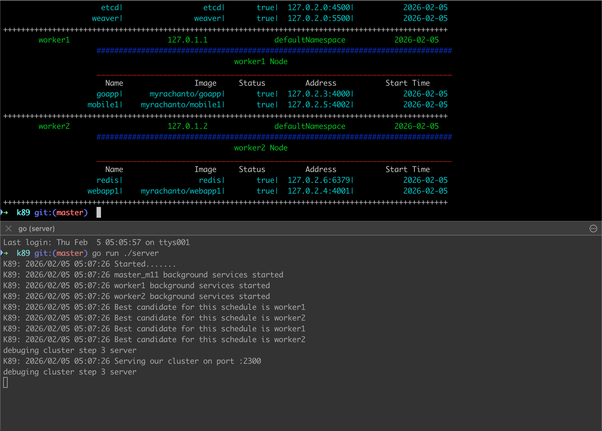

# K89: A Kubernetes-Inspired Cluster Simulator

> **Warning**: This is a *dummy* Kubernetes implementation created just for fun! 🎉 Not for production use (obviously).



## 📖 Overview

K89 is a simplified Kubernetes-like cluster orchestration system written in Go. It simulates the core concepts of Kubernetes including nodes, pods, and basic scheduling, all communicating via RPC (Remote Procedure Call).

## 🎯 Features

- **Cluster Management**: Create and manage a mini Kubernetes-style cluster
- **Node Orchestration**: Support for master and worker nodes
- **Pod Scheduling**: Basic round-robin scheduling across worker nodes
- **RPC Communication**: Client-server architecture using Go's `net/rpc`
- **CLI Interface**: Command-line tools to interact with your cluster
- **Colorful Output**: Terminal eye candy with the `fatih/color` package

## 🏗️ Architecture

### Components

1. **SystemController (Server)**: The brain of K89
   - Manages nodes and pods
   - Handles scheduling decisions
   - Exposes RPC endpoints

2. **CommandLine Client**: Interactive CLI
   - Create/delete nodes and pods
   - View cluster status
   - List resources

### Node Types

- **Master Node** (`master_m11`): Runs control plane components
  - `kubeadm`: Cluster initialization (port 7373)
  - `etcd`: Key-value store (port 4500)
  - `weaver`: Network plugin (port 5500)

- **Worker Nodes**: Run your application pods
  - Schedulable for user workloads
  - Load-balanced pod distribution

## 🚀 Getting Started

### Prerequisites

```bash
go get github.com/fatih/color
```

### Installation

1. Clone the repository:
```bash
git clone <your-repo-url>
cd k89
```

2. Start the server:
```bash
go run server/main.go
```

3. In another terminal, run the client:
```bash
go run client/main.go
```

## 💻 Usage

### View Cluster Status

```bash
go run client/main.go showcluster
```

### Create a Node

```bash
go run client/main.go createNode -name worker3
```

### Create a Pod

```bash
go run client/main.go createPod -name myapp -image myrachanto/myapp -port 8080
```

### List Nodes

```bash
go run client/main.go nodelists
```

### List Pods

```bash
go run client/main.go podlists
```

## 📊 Default Cluster Setup

When you start the server, it automatically creates:

- **1 Master Node**: `master_m11`
- **2 Worker Nodes**: `worker1`, `worker2`
- **4 Sample Pods**:
  - `goapp` (myrachanto/goapp:4000)
  - `webapp1` (myrachanto/webapp1:4001)
  - `mobile1` (myrachanto/mobile1:4002)
  - `redis` (redis:6379)

## 🔧 How It Works

### Scheduling Algorithm

K89 uses a simple **least-loaded** scheduling strategy:

1. Counts pods on each worker node
2. Selects the node with the fewest pods
3. Assigns the new pod to that node

### Addressing Scheme

- **Nodes**: `127.0.1.x` (where x is the node number)
- **Pods**: `127.0.2.x` (where x is the pod number)
- **RPC Server**: `localhost:2300`

### Node Naming Convention

Nodes ending with `_m11` are treated as master nodes and are not schedulable for regular pods.

## 📁 Project Structure

```
k89/
├── server/
│   └── main.go          # Server implementation
├── client/
│   └── main.go          # CLI client
└── README.md
```

## 🎨 Sample Output

```
                                         K89:  Cluster                                         
____________________________________________________________________________________________________
Name          Address                        Namespace                   Start Time  
master_m11    127.0.1.0                      defaultNamespace            2026-02-05 

                    ################################################################################
                                              master_m11 Node                                      
                    ________________________________________________________________________________
           Name                Image     Status         Address           Start Time 
       kubeadm1 |          kubeadm1 |       true| 127.0.2.0:7373|           2026-02-05 
          etcd1 |             etcd1 |       true| 127.0.2.0:4500|           2026-02-05 
       weaver1  |          weaver1  |       true| 127.0.2.0:5500|           2026-02-05 
```

## 🤓 Learning Goals

This project demonstrates:

- Go's RPC capabilities
- Basic cluster orchestration concepts
- Client-server architecture
- Command-line interface design
- Data structures for resource management

## ⚠️ Limitations

- No persistent storage (everything in memory)
- No actual container execution
- Simplified scheduling (no resource constraints)
- No health checks or pod restarts
- Single-master architecture only

## 🎓 Educational Use

Perfect for:

- Understanding Kubernetes concepts
- Learning Go RPC programming
- Exploring distributed systems basics
- Building CLI tools in Go

## 🤝 Contributing

This is a fun project! Feel free to:

- Add more realistic scheduling algorithms
- Implement health checks
- Add more CLI commands
- Improve error handling
- Add tests

## 📝 License

This is a learning project. Use it however you like!

## 🙏 Acknowledgments

- Inspired by Kubernetes
- Built with Go's standard library
- Colorful output powered by `fatih/color`

---

**Remember**: K89 is not K8s! It's just for fun and learning. For real container orchestration, use actual Kubernetes. 🚀